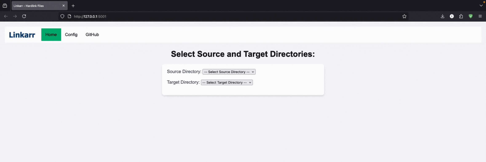

<h1 align="center">
  <br>
  <a href="http://www.amitmerchant.com/electron-markdownify"></a>
  <br>
  Linkarr
  <br>
</h1>

<h4 align="center">A simple graphical tool for hardlinking files, built with Python and Flask.</h4>

<p align="center">
  <a href="https://www.python.org">
    
  </a>
<a href="docker.com">
</a>
</a>

</p>
<p align="center">
<a href="https://buymeacoffee.com/imadahmad" target="_blank"></a>
</p>

<p align="center">
  <a href="#about">About</a> •
  <a href="#features">Features</a> •
  <a href="#installation">Installation</a> •
</p>



## About

Linkarr is a simple graphical tool for hardlinking files, built with Python and Flask. It allows users to easily create hard links between files, making it easier to manage and organize their file system. The application is designed to be user-friendly and intuitive, making it accessible to users of all skill levels.

## Features

- **File Hardlinking**: Create hard links between files with a graphical interface.
- **Directory Hardlinking**: Create hard links between directories with a graphical interface.

##### Features to be added:

- **Symlink Support**: Create symbolic links between files and directories.
- **Automatic File Detection**: Automatically detect files and directories and hardlink them.
- **Remove Hardlinks**: Remove hard links from files and directories.
- **Detect Hardlinks**: Detect hard links in files and directories.
- **Dark Mode**: A dark mode theme option for the application.

## Installation and Usage

### Installation with Docker

You can quickly get started with Linkarr using Docker. Just run the following command:

```bash
docker run -d -p <host-port>:5001 -v /absolute/path/to/your/files:/data imadahmad97/linkarr:latest
```

- `<host-port>`: The port on your machine that you want to access Linkarr from (e.g., `5001`).
- `/path/to/your/files`: The absolute path on your machine that contains the **source** and **target** directories you'd like to work with.

<br>

You can also use Docker Compose to run Linkarr. Create a `docker-compose.yml` file with the following content:

```yaml
version: "3.8"

services:
  linkarr:
    image: imadahmad97/linkarr:latest
    ports:
      - "<host-port>:5001"
    volumes:
      - /absolute/path/to/your/files:/data
    restart: unless-stopped
```

- `<host-port>`: The port on your machine that you want to access Linkarr from (e.g., `5001`).
- `/path/to/your/files`: The absolute path on your machine that contains the **source** and **target** directories you'd like to work with.

### Usage

1. Open your web browser and navigate to `http://localhost:<host-port>` (e.g., 'http://localhost:5001').
2. You will see the Linkarr interface. Navigate to the Config tab.
3. Add the paths to your source and target directories. Remember this is the path within the container, not your host machine.
4. Click "Update Configurations" to save your settings.
5. Navigate to the Home tab and select the source and target directories, as well as the files and directories you want to hardlink.
6. Click "Submit" and enjoy!
